# Xania Hotel Booking Database — SQL Design Project


## Overview

Xania Hotel Booking Database is a relational database design and SQL project for a hotel booking management system. It was developed as part of an Introduction to Database academic group project, and this repository is a cleaned, portfolio-ready version focused on database design, SQL implementation, and query analysis.

## Project Scope

This project demonstrates:

- relational database design
- business rules
- normalization
- ERD design
- SQL DDL table creation
- sample data insertion
- SQL DML queries
- query result analysis

## Team Contribution

- Contributed to DBMS advantages analysis and case study discussion
- Contributed to UNF/normalization preparation
- Prepared and formatted parts of the assignment documentation
- Developed DML queries related to customer reservation analysis and hotel revenue reporting
- Helped present the database design in a structured academic format

## Database Entities

- Branch
- RoomType
- Room
- Customer
- Staff
- Booking
- Payment

## Technologies Used

- SQL
- Microsoft SQL Server / SSMS
- Relational database design
- ERD
- Normalization
- DDL
- DML

## Project Structure

```text
xania-hotel-database-sql/
├── .gitignore
├── queries.sql
├── README.md
├── sample-data.sql
├── schema.sql
├── diagrams/
│   ├── dbms-relationship-diagram.png
│   └── entitiy-relationship-diagram.png
├── documentation/
│   ├── add-clean-documentation-here.txt
│   ├── database-project-summary.md
│   └── xania-hotel-database-project-summary.pdf
└── screenshots/
    ├── booking-table-query.png
    ├── booking-table.png
    ├── branch-table.png
    ├── customer-table-query.png
    ├── customer-table.png
    ├── payment-table-query.png
    ├── payment-table.png
    ├── room-table-query.png
    ├── room-table.png
    ├── room-type-table.png
    ├── staff-table-query.png
    └── staff-table.png
```

## How to Use

1. Open SQL Server Management Studio or another compatible SQL environment.
2. Create a new database.
3. Run `schema.sql` to create tables.
4. Run `sample-data.sql` to insert sample data.
5. Run `queries.sql` to test the DML queries.

## SQL Features Demonstrated

- `CREATE TABLE`
- `PRIMARY KEY`
- `FOREIGN KEY`
- `INSERT INTO`
- `SELECT`
- `JOIN`
- `LEFT JOIN`
- `WHERE`
- `GROUP BY`
- `HAVING`
- `ORDER BY`
- `SUM`
- `COUNT`
- date filtering

## Diagrams

### Entity Relationship Diagram

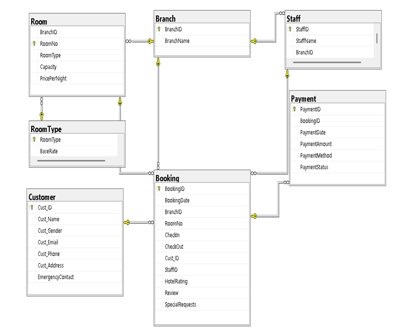

### DBMS Relationship Diagram

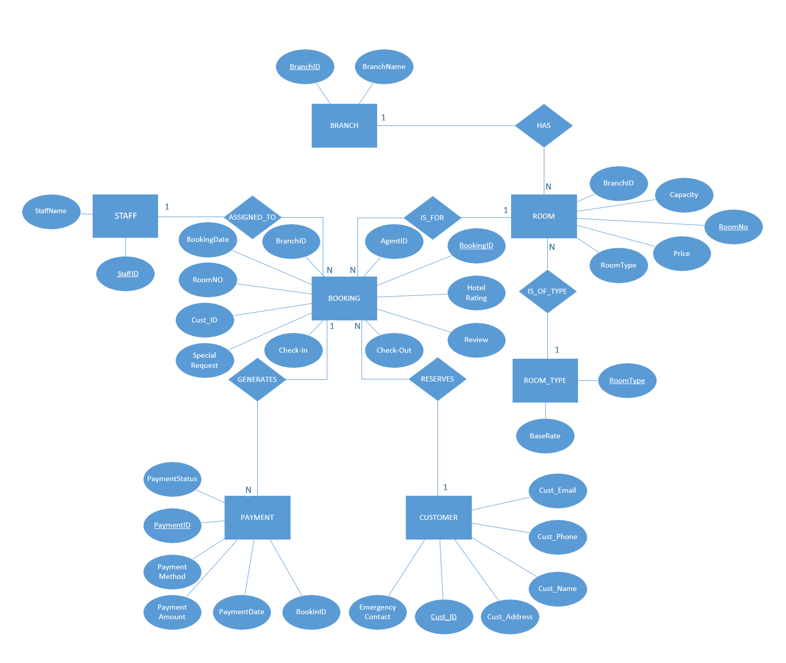

## Screenshots

### Branch Table

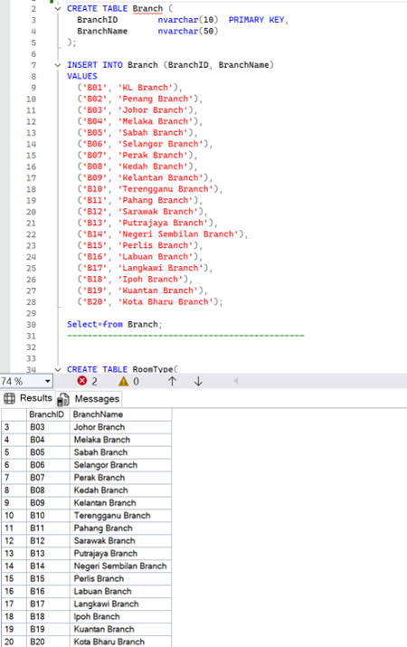

### Room Type Table

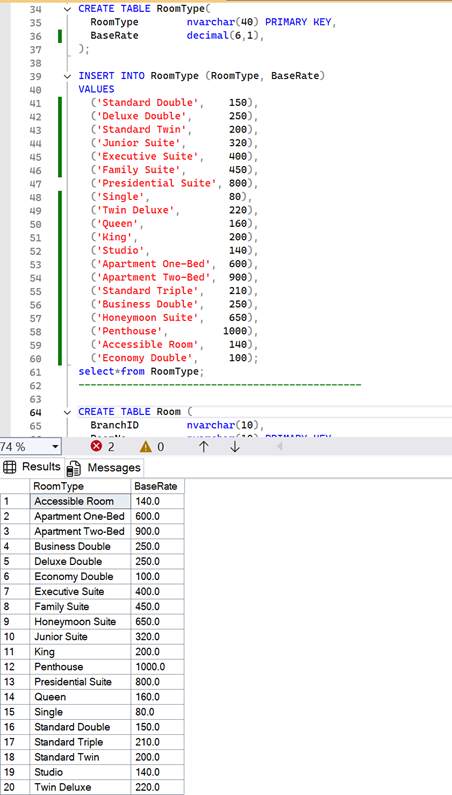

### Room Table

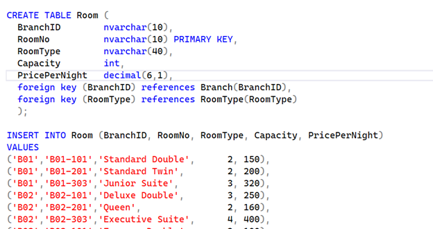

### Room Table Query

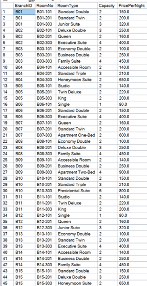

### Customer Table

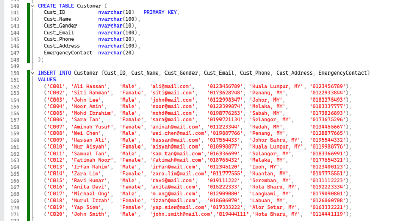

### Customer Table Query

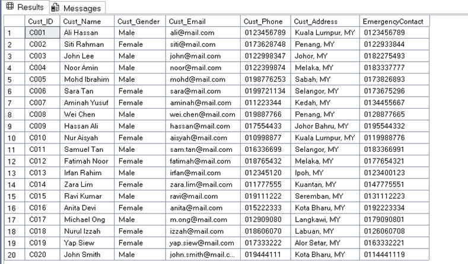

### Staff Table

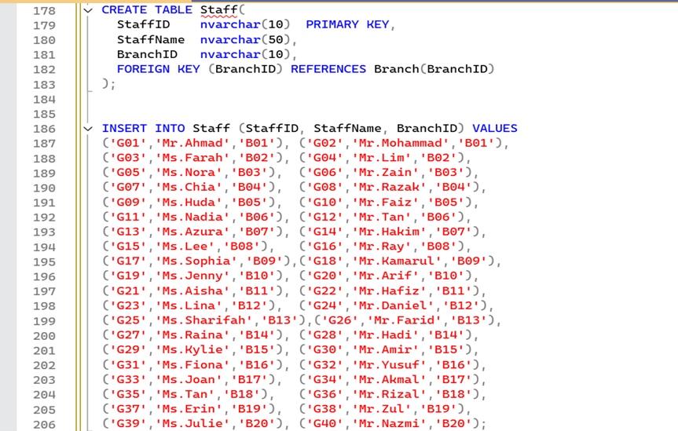

### Staff Table Query

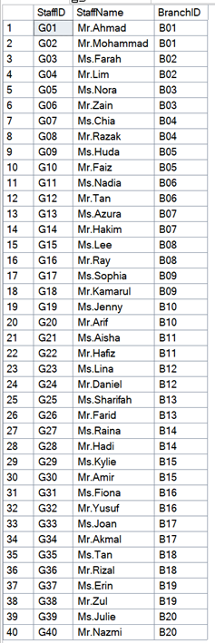

### Booking Table

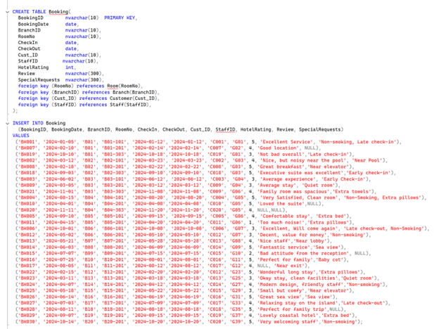

### Booking Table Query

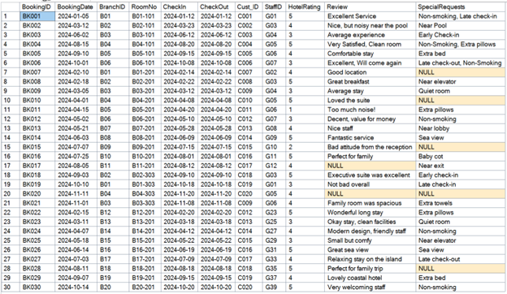

### Payment Table

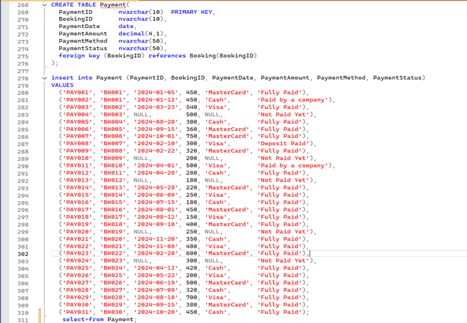

### Payment Table Query

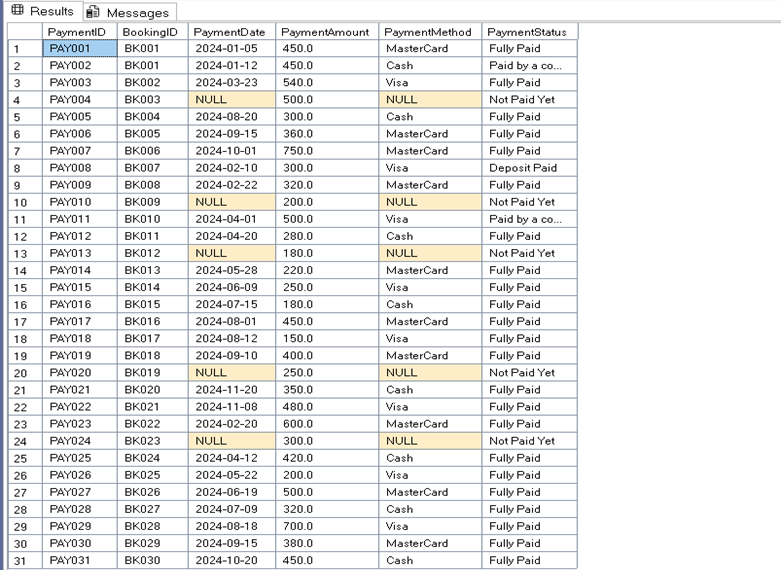

## Documentation

- [Database Project Summary](documentation/database-project-summary.md)
- [Xania Hotel Database Project Summary PDF](documentation/xania-hotel-database-project-summary.pdf)

## What We Learned

- relational database design
- normalization
- entity relationship modelling
- SQL table creation
- primary and foreign keys
- SQL joins and aggregation
- query testing and result interpretation

## Future Improvements

- add stored procedures
- add views
- improve constraints
- add indexes
- connect database to an application
- build a dashboard from the SQL data

## Privacy Notes

This repository is a cleaned portfolio version of an academic group project. Private academic identifiers, internal submission details, and unsanitized university-only files are intentionally excluded.
